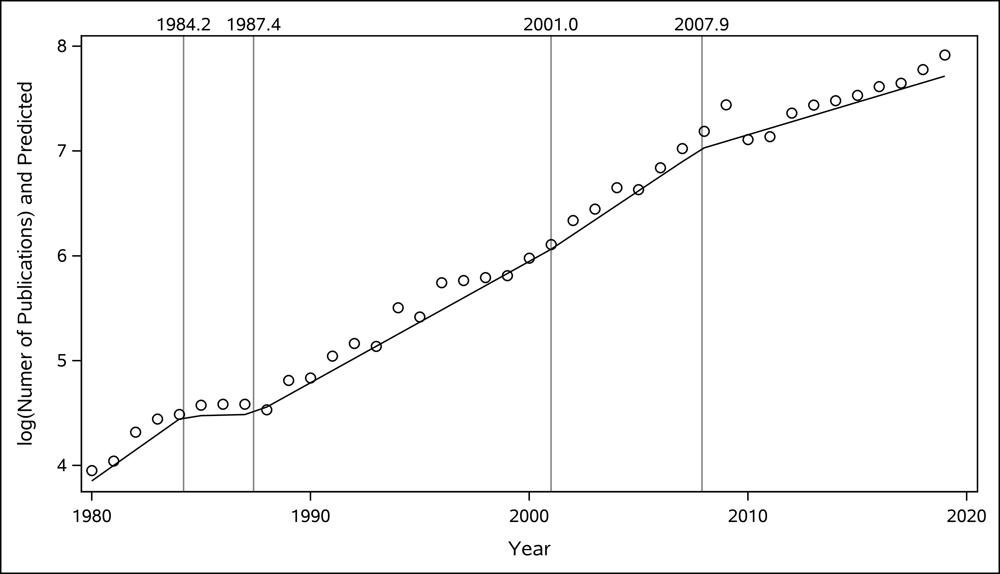

```{r setup, include=FALSE}
options(scipen=999)
library(rmarkdown)
library(flexdashboard)
library(pipeR)
library(tidyverse)
library(rio)
library(ggraph)
library(tidygraph)
library(DT)
library(plotly)
library(visNetwork)
library(igraph)
library(ggthemes)
library(highcharter)
library(lubridate)
library(sparkline)
library(htmlwidgets)
```

# General 


Column {data-width=500 .tabset}
-------------------------------------


### Overview

> adicionar imagens ou recursos dinâmicos

> - __52,000,000__ Total Registers - Scopus \n
> - __4.13%__ Growth Rate - Scopus \n
> - __17 Years__ Doubling Time - Scopus \n

> - __13,516__ Total Registers - Shelf Life \n
> - __12.9%__ Growth Rate - Shelf Life \n
> - __5.6__ Years Doubling Time - Shelf Life \n

>

### Segmented Growth

<!-- Talvez fazer esse gráfico no ggplot2  -->

```{r, out.width='75%'}
# 

# graphics
import('shelf_life_growth.txt') %>>% 
    as_tibble %>>% 
    rename(PY = V1, publications = V2 ) %>>% 
    dplyr::filter(PY %in% c(1980:2019)) %>>% 
    dplyr::arrange(PY) %>>% 
    dplyr::mutate(trend=1:n()) %>>% 
    (. -> d)

d$lnp <- log(d$publications)

PY <- d$PY
d$est1 <- NA

d$est <- ifelse(PY <= 1986.0, -441.3+(0.2239)*PY,
                ifelse(PY<=1992.0, -441.3 + (0.2239)*1986.0 + 0.0511*(PY-1986.0), 
                       ifelse(PY<=2004.8, -441.3 + (0.2239)*1986.0 + 0.0511*(1992.0-1986.0) + 0.1510*(PY-1992.0), 
                              -441.3 +  (0.2239)*1986.0 + 0.0511*(1992.0-1986.0) + 0.1510*(2004.8-1992.0) + 0.1186*(PY-2004.8)
                    )))

d %>>% 
    mutate(Publications=lnp, Year=PY) %>>% 
    (. -> d2)

hchart(d2, "line", hcaes(x = Year, y = Publications), name = "Publications", showInLegend = TRUE, fillOpacity = 0.2) %>>% 
    hc_add_series(d2, "line", hcaes(x = Year, y = est), name = "Segmented Regression", showInLegend = TRUE, fillOpacity = 0.2) %>>% 
    hc_add_theme(hc_theme_elementary()) %>>% 
    hc_navigator( enabled = TRUE) %>>% 
    hc_xAxis( plotLines = list( list( value = 1986, color = "#FF0000", label = list( text = "1986", align = "top", style = list(color = "#FF0000"))))) 
```


### Groups Growth
    
```{r}

netcoup <- import('netcoup.rds')
a <- import('netcoup_grupos.rds')

netcoup %>>% 
    activate(nodes) %>>% 
    as_tibble %>>% 
    dplyr::filter(!is.na(grupo)) %>>% 
    group_by(PY,grupo) %>>% 
    tally(sort=TRUE) %>>% 
    arrange(grupo,desc(PY)) %>>% 
    ungroup %>>% 
    dplyr::filter(PY %in% c(2000:2019)) %>>% 
    dplyr::mutate(Group=grupo,Publications = n, Year = PY) %>>% 
    (. -> grupoAno)

hchart(grupoAno, "line", hcaes(x = Year, y = Publications, group = Group))

# ----------
## teste para descatar apenas a linha selecionada
#
grupoAno %>>% 
    count(grupo, sort=T) %>>% 
    slice(1:3) %>>% 
    pull(grupo) %>>% 
    (. -> tt)

grupoAno %>>% 
    dplyr::filter(grupo %in% tt) %>>% 
    hchart("line", hcaes(x = Year, y = Publications, group = Group))

```

### Groups Description
    
```{r}
data.frame(Group=paste0('g',1:13),Description='algum texto para descrever o grupo') %>>% 
    datatable(options=list(pageLength=13, dom = 'tip'), rownames=F)  
```


Column {data-width=500 .tabset}
-------------------------------------

### Growth

```{r}
# graphics
import('shelf_life_growth.txt') %>>% 
    as_tibble %>>% 
    rename(PY = V1, publications = V2 ) %>>% 
    dplyr::filter(PY %in% c(1980:2019)) %>>% 
    dplyr::arrange(PY) %>>% 
    dplyr::mutate(trend=1:n()) %>>% 
    (. -> d)

# export(d, '~/OneDrive/Rworkspace/SASUniversityEdition/myfolder/shelf_life/shelf_life.csv')

d$lnp <- log(d$publications)

# ajustar parametros via mqo 
m1 <- lm(lnp ~ trend, data=d)

# summary(m1)

beta0 <- m1$coefficients[[1]]
beta1 <- m1$coefficients[[2]]

# modelo não linear
# 1980 é o primeiro ano da série
m2 <- nls(publications ~ b0*exp(b1*(PY-1980)), start = list(b0=beta0, b1=beta1), data=d)

# publications estimado
d$predicted <- 12.159638*exp(0.121922*(d$PY-1980))

d %>>% 
    mutate(Publications=publications, Year=PY) %>>% 
    (. -> d2)

hchart(d2, "column", hcaes(x = Year, y = Publications), name = "Publications", showInLegend = TRUE) %>>%
    hc_add_series(d2, "line", hcaes(x = Year, y = predicted), name = "Predicted", showInLegend = TRUE) %>>% 
    hc_add_theme(hc_theme_elementary()) %>>%
    hc_navigator( enabled = TRUE) 
```

### visNetwork

```{r}
netcoup <- import('netcoup.rds') 
hubs <- import('netcoup_hubs.rds') 

hubs %>>% 
    select(SR,Ki) %>>% 
    (. -> hubs2)

netcoup %>>% 
    activate(nodes) %>>% 
    left_join(hubs2) %>>% 
    (. -> netcoup)

netcoup %>>% 
    as_tbl_graph() %>>% 
    activate(nodes) %>>% 
    as_tibble %>>% 
    dplyr::filter(!is.na(grupo)) %>>% 
    group_by(grupo) %>>% 
    slice_max(TC, prop=.05) %>>% 
    (. -> topn)

netcoup %>>% 
    as_tbl_graph() %>>% 
    activate(nodes) %>>% 
    dplyr::filter(name %in% topn$name) %>>% 
    (. -> netcoup2)

tibble(id=1:length(V(netcoup2)),
       label=NA,
       group=V(netcoup2)$grupo,
       size=ifelse(V(netcoup2)$Ki==0,0.01,V(netcoup2)$Ki/30)
       ) %>>% 
(. -> nodes)

tibble(from = netcoup2 %>>% activate(edges) %>>% as_tibble %>>%  pull(from),
       to = netcoup2 %>>% activate(edges) %>>% as_tibble %>>%  pull(to),
       value=0.01,
       label=NA
       ) %>>% 
(. -> edges)

visNetwork(nodes, edges, height = "650px", width = "650px") %>%
    visIgraphLayout() %>>%
    visNodes(size = 2)  
```

### igraph + highcharter

```{r}
# netcoup <- import('netcoup.rds') 
# hubs <- import('netcoup_hubs.rds') 
# 
# hubs %>>% 
#     select(SR,Ki) %>>% 
#     (. -> hubs2)
# 
# netcoup %>>% 
#     activate(nodes) %>>% 
#     left_join(hubs2) %>>% 
#     (. -> netcoup)
# 
# netcoup %>>% 
#     as_tbl_graph() %>>% 
#     activate(nodes) %>>% 
#     as_tibble %>>% 
#     dplyr::filter(!is.na(grupo)) %>>% 
#     group_by(grupo) %>>% 
#     slice_max(TC, prop=.05) %>>% 
#     (. -> topn)
# 
# netcoup %>>% 
#     as_tbl_graph() %>>% 
#     activate(nodes) %>>% 
#     dplyr::filter(name %in% topn$name) %>>% 
#     (. -> net)
# 
# net %>>% 
#     activate(nodes) %>>% 
#     as_tibble %>>% 
#     mutate(label=name) %>>% 
#     select(name,label) %>>% 
#     mutate(label=paste(
#                        gsub(' .*$','',label), 
#                        gsub('.*\\.','',label),
#                        sep='' 
#                        )) %>>% 
#     (. -> label)
#     
# net %>>% 
#     activate(nodes) %>>% 
#     left_join(label) %>>% 
#     select(label,SR,PY,TI,DE,TC,Ki,grupo) %>>% 
#     (. -> net)
# 
# V(net)$name <- V(net)$label
# V(net)$color <- colorize(V(net)$grupo)
# V(net)$size <- V(net)$Ki/10
# 
# l <- layout_on_sphere(net)
# l <- layout_with_graphopt(net) # bom
# l <- layout_nicely(net) 
# l <- layout_with_fr(net) 

# png(filename="network.png", width = 7, height = 7, units = 'in', res = 300)
# p <- plot(
#      net,         
#      layout = l,
#      vertex.label = NA,         
#      vertex.label.font = 1,              
#      vertex.size = V(net)$Ki/30,
#      )
# dev.off()
# 

library(igraph)
N <- 40

net <- sample_gnp(N, p = 2 / N)
wc <- cluster_walktrap(net)

V(net)$label <- seq(N)
V(net)$name <- paste("I'm #", seq(N))
V(net)$page_rank <- round(page.rank(net)$vector, 2)
V(net)$betweenness <- round(betweenness(net), 2)
V(net)$degree <- degree(net)
V(net)$size <- V(net)$degree
V(net)$comm <- membership(wc)
V(net)$color <- colorize(membership(wc))

hchart(net, layout = layout_with_fr)
```


### Groups Attributes
    
```{r}

grupos <- sort(unique(grupoAno$Group))

# grupos <- grupos[1:3]

res <- vector('double', length(grupos))

for(i in seq_along(grupos)){ 

    grupoAno %>>% 
        dplyr::select(PY,n,Group) %>>% 
        dplyr::rename(publications = n) %>>% 
        dplyr::filter(PY >= 2000) %>>% 
        dplyr::arrange(PY) %>>%  
        dplyr::filter(Group==grupos[[i]]) %>>%
        dplyr::mutate(trend=1:n()) %>>%
        dplyr::mutate(lnp=log(publications)) %>>%
        (. -> d) 

    # ajustar parametros via mqo 
    m1 <- lm(lnp ~ trend, data=d)
    beta0 <- m1$coefficients[[1]]
    beta1 <- m1$coefficients[[2]]
    
    # modelo não linear
    m2 <- nls(publications ~ b0*exp(b1*(PY-2010)), start = list(b0=beta0, b1=beta1), data=d)
    res[[i]] <- coef(m2)[2]

}

# print(xtable(grupoAnoCrescimento, type = "latex"))

data.frame(Groups=grupos,Coef=res) %>>% 
    as_tibble %>>% 
    mutate(GrowthRateYear=(exp(Coef)-1)*100) %>>% 
    dplyr::select(-Coef) %>>% 
    left_join(import('netcoup_grupos.rds') %>>% select(nname,qtde.papers,PY.m) %>>% rename(Groups = nname)) %>>% 
    dplyr::arrange(Groups) %>>% 
    (. -> grupoAnoCrescimento) %>>%     
    dplyr::rename(AverageAge = PY.m) %>>% 
    dplyr::rename(TotalPapers = qtde.papers) %>>% 
    mutate(AverageAge = round(AverageAge,1)) %>>% 
    left_join(import('ZiPi.rds') %>>% mutate(Groups=grupo) %>>% select(Groups,Hubs)) %>>% 
    mutate(Description='Adicionar a descrição do grupo. Manter um texto o mais explicativo possível.') %>>% 
    relocate(Description, .after=Groups) %>>% 
    select(-Description) %>>% 
    datatable(options=list(pageLength=13, dom = 'tip'), rownames=F)  %>>% 
    formatRound('GrowthRateYear',1)
```

# g01 {data-navmenu="Groups"}

Em construção. 


# g02 {data-navmenu="Groups"}

Em construção. 


# g03 {data-navmenu="Groups"}

Em construção. 


# g04 {data-navmenu="Groups"}

Em construção. 


# Conclusions

Escrever algum texto para finalizar a análise.


# Pessoas  {.hidden}

Em construção. 


# Patentes  {.hidden}

Em construção.


