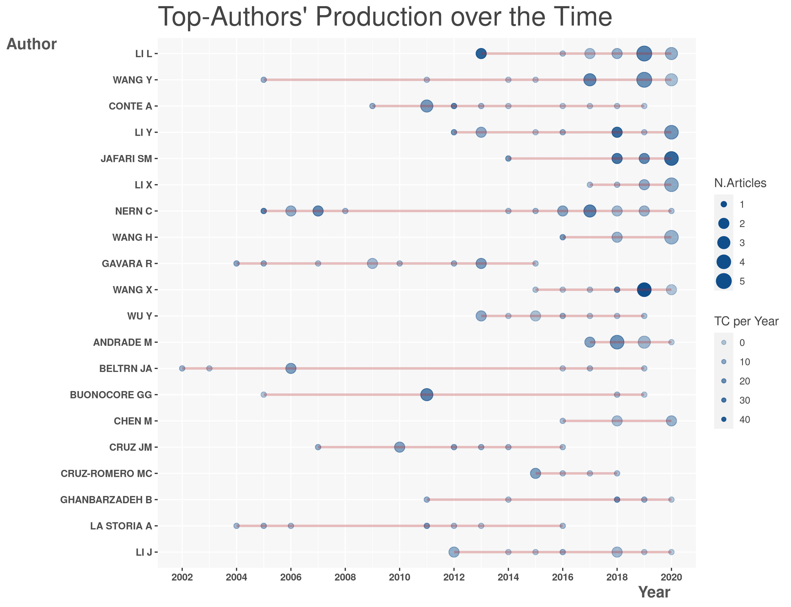
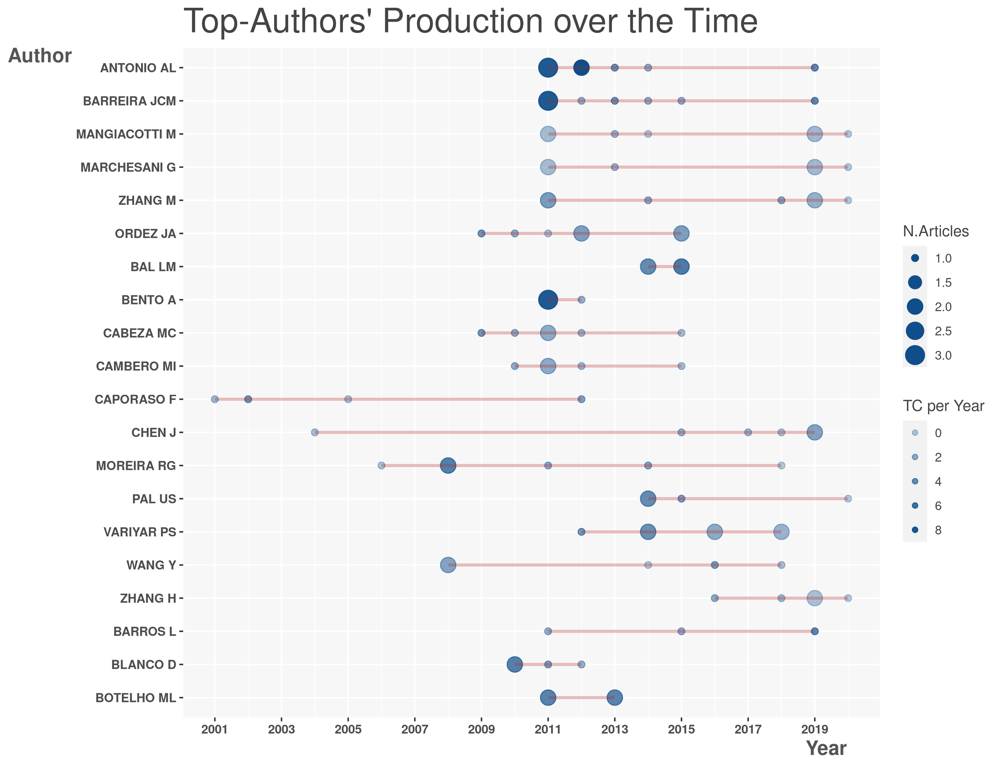
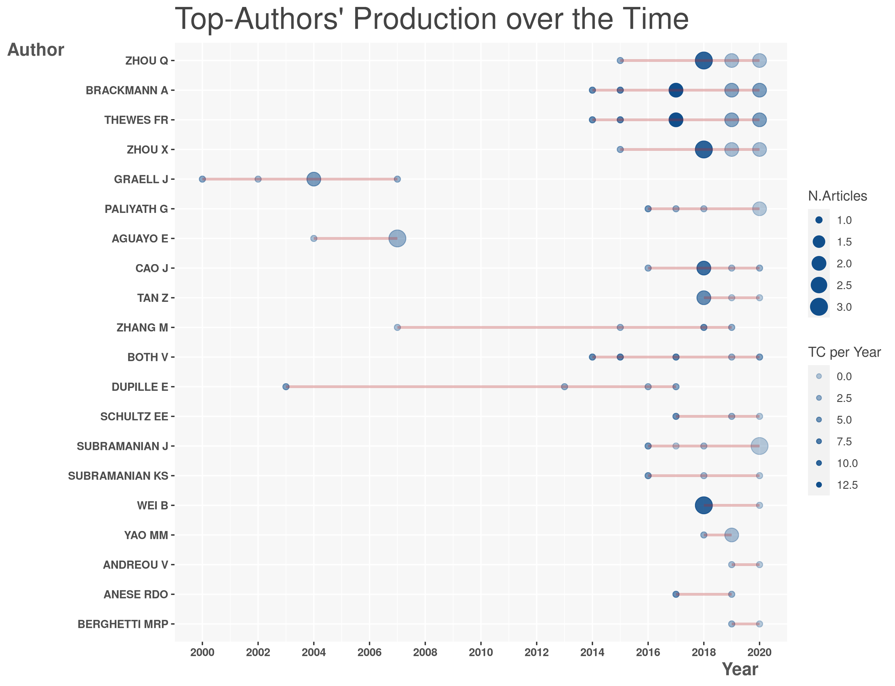
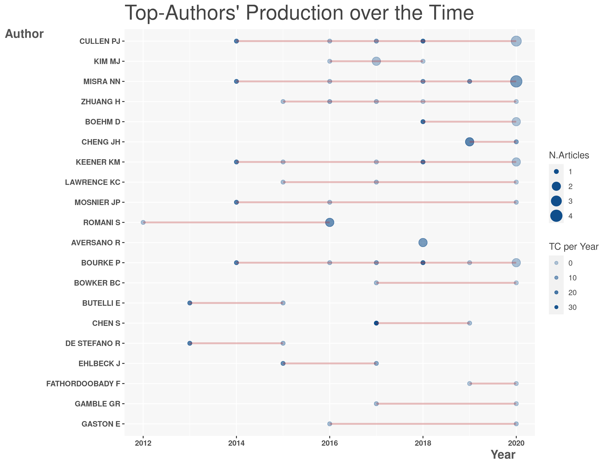

<!--
Opções no chunk

eval        incluir o resultado do código executado, pode ser logico ou numérico
echo        mostrar o código 
warning     mostrar mensagens de aviso
error       mostrar mensagens de erro
message     mostrar mensagens
tidy        mostrar ajustar o código ao display, ignora identação
comment     '##' ou qq símbolo, para os resultados dos códigos serem antecedidos por ##
include     se falso, executa mas não inclui o chunk no relatório
-->

```{r setup, include=FALSE}
options(scipen=999)
library(rmarkdown)
library(flexdashboard)
library(pipeR)
library(tidyverse)
library(rio)
library(ggraph)
library(tidygraph)
library(DT)
library(visNetwork)
library(igraph)
library(highcharter)
library(htmlwidgets)
library(printr)
library(shiny)
library(kableExtra)
```

<!--  ------------------------------------------------------------ -->

# General 


Column {data-width=500 .tabset}
-------------------------------------


### Target

<br> </br>
<h3>        - Which research area is emerging?  </h3> 
<br> </br>
<h3>        - What researcher to hire?  </h3> 
<br> </br>
<h3>        - What patent to buy?  </h3> 
<br> </br>


### Growth

```{r}

import('data/growth_shelf_life.rds') %>>% (. -> d2)

hchart(d2, "column", hcaes(x = Year, y = Publications), name = "Publications", showInLegend = TRUE) %>>%
    hc_add_series(d2, "line", hcaes(x = Year, y = predicted), name = "Predicted", showInLegend = TRUE) %>>% 
    hc_add_theme(hc_theme_elementary()) %>>%
    hc_navigator( enabled = TRUE)  %>>% 
    hc_exporting( enabled = TRUE, filename='groups_growth')
```


### Networks


```{r,dpi=120}
knitr::include_url('inseption_html/slides_networks.html', height='80%')
```

### Groups Attributes
    
```{r}
import('data/groups_attributes.rds') %>>% 
    datatable(extensions = 'Buttons', rownames=F,
              options = list(dom = 'Bfrtip', pageLength = 20,
                             buttons = list(list( 
                                                 extend='collection', 
                                                 buttons = list(list(extend='csv',filename='data'),
                                                                list(extend='excel',filename='data')),
                                                 text='Download')))) %>>% 
    formatRound('GrowthRateYear',1)
```


Column {data-width=500 .tabset}
-------------------------------------

### Shelf Life

<br> </br>

<h3> - Shelf Life </h3> 
<h4> - The length of time a product may be stored without becoming unsuitable for use or consumption. </h4> 

<br> </br>


<h3>  - Shelf Life Research </h3> 
<h4> - 13,516 Registers \n </h4>
<h4> - 12.9% Growth Rate \n </h4>
<h4> - 5.6 Years Doubling Time \n </h4>

<br> </br>

<h3> - Scopus Research </h3> 
<h4> - 52,000,000 Registers \n </h4>
<h4> - 4.13% Growth Rate \n </h4>
<h4> - 17 Years Doubling Time \n </h4>

>

### Segmented Growth

<!-- Talvez fazer esse gráfico no ggplot2  -->

```{r, out.width='75%'}

import('data/segmented_growth.rds') %>>% (. -> d2)

hchart(d2, "line", hcaes(x = Year, y = ln_Publications), name = "Publications", showInLegend = TRUE, fillOpacity = 0.2) %>>% 
    hc_add_series(d2, "line", hcaes(x = Year, y = est), name = "Segmented Regression", showInLegend = TRUE, fillOpacity = 0.2) %>>% 
    hc_add_theme(hc_theme_elementary()) %>>% 
    hc_navigator( enabled = TRUE) %>>% 
    hc_exporting( enabled = TRUE, filename='segmented_growth') %>>% 
    hc_xAxis( plotBands = list( list( from = 1986, to = 1986, color = "#330000" ),
                                list( from = 1992, to = 1992, color = "#330000" ),
                                list( from = 2004, to = 2004, color = "#330000" )
                               ))
```


### Groups Growth
    
```{r}
import('data/groups_growth.rds') %>>% (. -> groups_growth)

hchart(groups_growth, "line", hcaes(x = Year, y = Publications, group = Group), fillOpacity = 0.2) %>>% 
    hc_add_theme(hc_theme_elementary())  %>>% 
    hc_navigator( enabled = TRUE)  %>>% 
    hc_exporting( enabled = TRUE, filename='groups_growth')
```


### Groups Description

```{r}
import('data/groups_description.txt') %>>% 
    datatable(extensions = 'Buttons', rownames=F,
              options = list(dom = 'Bfrtip', pageLength = 20,
                             buttons = list(list( 
                                                 extend='collection', 
                                                 buttons = list(list(extend='csv',filename='data'),
                                                                list(extend='excel',filename='data')),
                                                 text='Download'))))
```

<!--  ------------------------------------------------------------ -->

# g03 {data-navmenu="Groups"}

<h4> Group g03 - Active food packaging technologies </h4>

Column {data-width=500 .tabset}
-------------------------------------

### Authors Network


```{r}
import('data/authorNet_g03.rds') %>>% (. -> authorNet)

visNetwork(authorNet$nodes, authorNet$edges, height = "750px", width='500px') %>>%
    visIgraphLayout(layout = "layout_with_kk")  %>>%
    visOptions(highlightNearest = TRUE)
```

### Authors Production 


```{r}
# import('data/authorProd_g05.rds') %>>% (. -> authorProd)
# authorProd$graph

```

### Authors

```{r}
import('data/indices_g03.rds') %>>% 
    mutate(m_index=round(m_index,2)) %>>% 
    (kable(.,'html')) %>>% 
    kable_styling() %>>% 
    scroll_box(width = "100%", height = "460px")
```

<h5> H-index is defined as the maximum value of h such that the given author/journal has published h papers that have each been cited at least h times. </h5> 
<h5> G-index is an improvement of the h-index. If this set is ranked in decreasing order of the number of citations that they received, the g-index is the (unique) largest number such that the top g articles received (together) at least g2 citations.   </h5> 
<h5> M-Index is the H-index divided by the number of years that a scientist has been active. </h5> 

Column {data-width=500 .tabset}
-------------------------------------


### Countries Network

```{r}

import('data/countryNet_g03.rds') %>>% (. -> countryNet)

visNetwork(countryNet$nodes, countryNet$edges, height = "750px", width='500px') %>>% 
    visIgraphLayout(layout = "layout_with_fr")  %>>% 
    visOptions(highlightNearest = TRUE)
```

### Papers Hubs

```{r eval=T}
import('data/netcit_hubs_full_info.xlsx') %>>% 
    as_tibble %>>% 
    dplyr::filter(grupo=='g03') %>>% 
    rename(Group = grupo) %>>% 
    relocate(AU,.after=Group) %>>% 
    select(-SR) %>>% 
    slice(1:50) %>>% 
    (. -> papersHub)

papersHub  %>>% 
    datatable(
              rownames = FALSE,
              extensions = 'Buttons', 
              options = list( 
                             dom = 'Bfrtip',
                             columnDefs = list(list(visible=FALSE, targets=c(3:4,8:10))), 
                             buttons = list(list(extend = 'colvis', columns = c(0:(ncol(papersHub)-1)))
                             )
              )
    )

```

<!--  ------------------------------------------------------------ -->

# g09 {data-navmenu="Groups"}

<h4> Group g09 - Food irradiation </h4>

Column {data-width=500 .tabset}
-------------------------------------

### Authors Network


```{r}
import('data/authorNet_g09.rds') %>>% (. -> authorNet)

visNetwork(authorNet$nodes, authorNet$edges, height = "750px", width='500px') %>>%
    visIgraphLayout(layout = "layout_with_kk")  %>>%
    visOptions(highlightNearest = TRUE)
```

### Authors Production 


```{r}
# import('data/authorProd_g05.rds') %>>% (. -> authorProd)
# authorProd$graph

```

### Authors

```{r}
import('data/indices_g09.rds') %>>% 
    mutate(m_index=round(m_index,2)) %>>% 
    (kable(.,'html')) %>>% 
    kable_styling() %>>% 
    scroll_box(width = "100%", height = "460px")
```

<h5> H-index is defined as the maximum value of h such that the given author/journal has published h papers that have each been cited at least h times. </h5> 
<h5> G-index is an improvement of the h-index. If this set is ranked in decreasing order of the number of citations that they received, the g-index is the (unique) largest number such that the top g articles received (together) at least g2 citations.   </h5> 
<h5> M-Index is the H-index divided by the number of years that a scientist has been active. </h5> 

Column {data-width=500 .tabset}
-------------------------------------


### Countries Network

```{r}

import('data/countryNet_g09.rds') %>>% (. -> countryNet)

visNetwork(countryNet$nodes, countryNet$edges, height = "750px", width='500px') %>>% 
    visIgraphLayout(layout = "layout_with_fr")  %>>% 
    visOptions(highlightNearest = TRUE)
```

### Papers Hubs

```{r eval=T}
import('data/netcit_hubs_full_info.xlsx') %>>% 
    as_tibble %>>% 
    dplyr::filter(grupo=='g09') %>>% 
    rename(Group = grupo) %>>% 
    relocate(AU,.after=Group) %>>% 
    select(-SR) %>>% 
    slice(1:50) %>>% 
    (. -> papersHub)

papersHub  %>>% 
    datatable(
              rownames = FALSE,
              extensions = 'Buttons', 
              options = list( 
                             dom = 'Bfrtip',
                             columnDefs = list(list(visible=FALSE, targets=c(3:4,8:10))), 
                             buttons = list(list(extend = 'colvis', columns = c(0:(ncol(papersHub)-1)))
                             )
              )
    )

```

<!--  ------------------------------------------------------------ -->

# g15 {data-navmenu="Groups"}

<h4> Group g15 - Osmotic dehydration of fruits and vegetables </h4>

Column {data-width=500 .tabset}
-------------------------------------

### Authors Network


```{r}
import('data/authorNet_g15.rds') %>>% (. -> authorNet)

visNetwork(authorNet$nodes, authorNet$edges, height = "750px", width='500px') %>>%
    visIgraphLayout(layout = "layout_with_kk")  %>>%
    visOptions(highlightNearest = TRUE)
```

### Authors Production 


```{r}
# import('data/authorProd_g05.rds') %>>% (. -> authorProd)
# authorProd$graph

```

### Authors

```{r}
import('data/indices_g15.rds') %>>% 
    mutate(m_index=round(m_index,2)) %>>% 
    (kable(.,'html')) %>>% 
    kable_styling() %>>% 
    scroll_box(width = "100%", height = "460px")
```

<h5> H-index is defined as the maximum value of h such that the given author/journal has published h papers that have each been cited at least h times. </h5> 
<h5> G-index is an improvement of the h-index. If this set is ranked in decreasing order of the number of citations that they received, the g-index is the (unique) largest number such that the top g articles received (together) at least g2 citations.   </h5> 
<h5> M-Index is the H-index divided by the number of years that a scientist has been active. </h5> 

Column {data-width=500 .tabset}
-------------------------------------


### Countries Network

```{r}

import('data/countryNet_g15.rds') %>>% (. -> countryNet)

visNetwork(countryNet$nodes, countryNet$edges, height = "750px", width='500px') %>>% 
    visIgraphLayout(layout = "layout_with_fr")  %>>% 
    visOptions(highlightNearest = TRUE)
```

### Papers Hubs

```{r}
import('data/netcit_hubs_full_info.xlsx') %>>% 
    as_tibble %>>% 
    dplyr::filter(grupo=='g15') %>>% 
    rename(Group = grupo) %>>% 
    relocate(AU,.after=Group) %>>% 
    select(-SR) %>>% 
    (. -> papersHub)

papersHub  %>>% 
    datatable(
              rownames = FALSE,
              extensions = 'Buttons', 
              options = list( 
                             dom = 'Bfrtip',
                             columnDefs = list(list(visible=FALSE, targets=c(3:4,8:10))), 
                             buttons = list(list(extend = 'colvis', columns = c(0:(ncol(papersHub)-1)))
                             )
              )
    )

```


<!--  ------------------------------------------------------------ -->

# g16 {data-navmenu="Groups"}

<h4> Group g16 - Cold plasma and oxidative stability </h4>

Column {data-width=500 .tabset}
-------------------------------------

### Authors Network


```{r}
import('data/authorNet_g16.rds') %>>% (. -> authorNet)

visNetwork(authorNet$nodes, authorNet$edges, height = "750px", width='500px') %>>%
    visIgraphLayout(layout = "layout_with_kk")  %>>%
    visOptions(highlightNearest = TRUE)
```

### Authors Production 


```{r}
# import('data/authorProd_g05.rds') %>>% (. -> authorProd)
# authorProd$graph

```

### Authors

```{r}
import('data/indices_g16.rds') %>>% 
    mutate(m_index=round(m_index,2)) %>>% 
    (kable(.,'html')) %>>% 
    kable_styling() %>>% 
    scroll_box(width = "100%", height = "460px")
```

<h5> H-index is defined as the maximum value of h such that the given author/journal has published h papers that have each been cited at least h times. </h5> 
<h5> G-index is an improvement of the h-index. If this set is ranked in decreasing order of the number of citations that they received, the g-index is the (unique) largest number such that the top g articles received (together) at least g2 citations.   </h5> 
<h5> M-Index is the H-index divided by the number of years that a scientist has been active. </h5> 


Column {data-width=500 .tabset}
-------------------------------------


### Countries Network

```{r}

import('data/countryNet_g16.rds') %>>% (. -> countryNet)

visNetwork(countryNet$nodes, countryNet$edges, height = "750px", width='500px') %>>% 
    visIgraphLayout(layout = "layout_with_fr")  %>>% 
    visOptions(highlightNearest = TRUE)
```

### Papers Hubs

```{r}

import('data/netcit_hubs_full_info.xlsx') %>>% 
    as_tibble %>>% 
    dplyr::filter(grupo=='g16') %>>% 
    rename(Group = grupo) %>>% 
    relocate(AU,.after=Group) %>>% 
    select(-SR) %>>% 
    (. -> papersHub)

papersHub  %>>% 
    datatable(
              rownames = FALSE,
              extensions = 'Buttons', 
              options = list( 
                             dom = 'Bfrtip',
                             columnDefs = list(list(visible=FALSE, targets=c(3:4,8:10))), 
                             buttons = list(list(extend = 'colvis', columns = c(0:(ncol(papersHub)-1)))
                             )
              )
    )

```


<!--  ------------------------------------------------------------ -->

# Conclusions

Column {data-width=700}
-------------------------------------

###

```{r,dpi=170}
knitr::include_url('inseption_html/slides_conclusion.html', height='80%')
```

Column {data-width=300}
-------------------------------------

### Informations

<!--
<h4> A4F Group </h4>

<h5> Roney Fraga Souza </h5>

<h5> Demais Pesquisadores </h5>
-->

<!--  ------------------------------------------------------------ -->

# People  {.hidden}

developing...

<!--  ------------------------------------------------------------ -->

# Patent  {.hidden}

developing...


