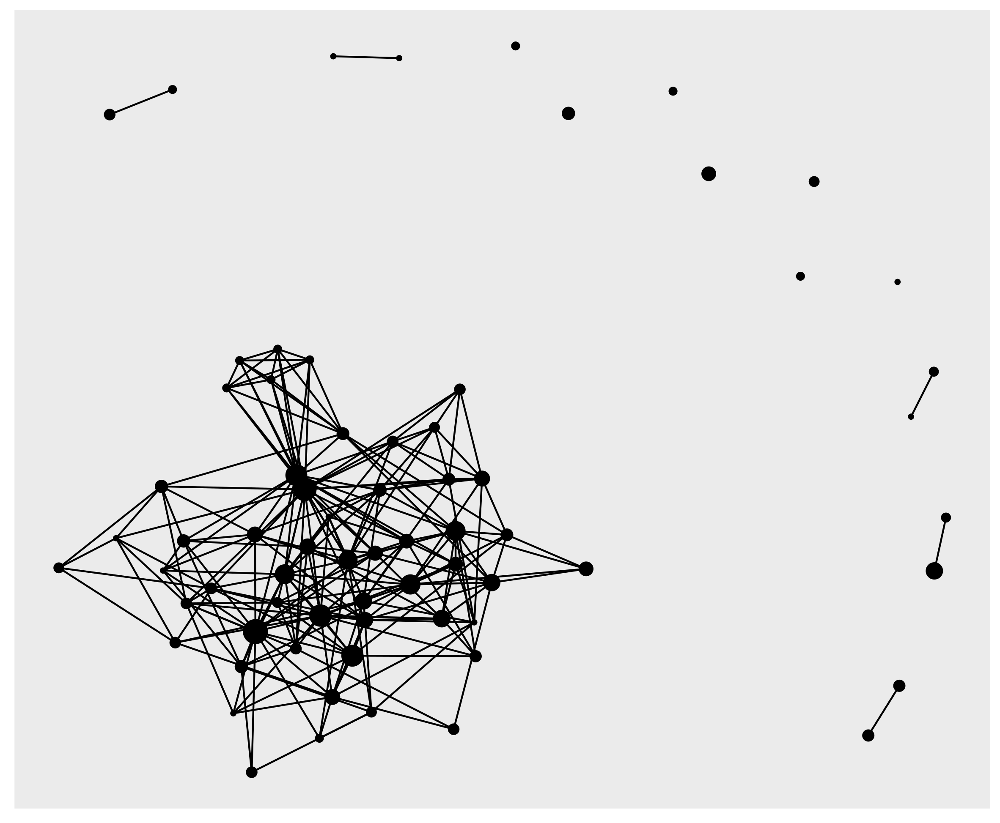

<!--
Opções no chunk

eval        incluir o resultado do código executado, pode ser logico ou numérico
echo        mostrar o código 
warning     mostrar mensagens de aviso
error       mostrar mensagens de erro
message     mostrar mensagens
tidy        mostrar ajustar o código ao display, ignora identação
comment     '##' ou qq símbolo, para os resultados dos códigos serem antecedidos por ##
include     se falso, executa mas não inclui o chunk no relatório
-->

```{r setup, include=FALSE}
options(scipen=999)
library(rmarkdown)
library(flexdashboard)
library(pipeR)
library(tidyverse)
library(rio)
library(ggraph)
library(tidygraph)
library(DT)
library(visNetwork)
library(igraph)
library(highcharter)
library(htmlwidgets)
library(printr)
library(shiny)
library(kableExtra)
```


# General 


Column {data-width=500 .tabset}
-------------------------------------


### Target

<br> </br>
<h3>        - Qual área de pesquisa é emergente?  </h3> 
<br> </br>
<h3>        - Qual pesquisador contratar?  </h3> 
<br> </br>
<h3>        - Qual patente comprar?  </h3> 
<br> </br>


### Growth

```{r}

import('data/growth_shelf_life.rds') %>>% (. -> d2)

hchart(d2, "column", hcaes(x = Year, y = Publications), name = "Publications", showInLegend = TRUE) %>>%
    hc_add_series(d2, "line", hcaes(x = Year, y = predicted), name = "Predicted", showInLegend = TRUE) %>>% 
    hc_add_theme(hc_theme_elementary()) %>>%
    hc_navigator( enabled = TRUE)  %>>% 
    hc_exporting( enabled = TRUE, filename='groups_growth')
```


### Networks


```{r,dpi=150}
knitr::include_url('inseption_html/revealjs_defaults.html', height='90%')
```

### Groups Attributes
    
```{r}
import('data/groups_attributes.rds') %>>% 
    datatable(extensions = 'Buttons', rownames=F,
              options = list(dom = 'Bfrtip', pageLength = 13,
                             buttons = list(list( 
                                                 extend='collection', 
                                                 buttons = list(list(extend='csv',filename='data'),
                                                                list(extend='excel',filename='data')),
                                                 text='Download')))) %>>% 
    formatRound('GrowthRateYear',1)
```


Column {data-width=500 .tabset}
-------------------------------------

### Shelf Life

<br> </br>

<h3>  - Shelf Life </h3> 
<h4> O período total de tempo entre a data de fabricação, embalagem, transporte e armazenagem, que ainda permanece utilizável para o consumo pelo usuário final. </h4> 

<br> </br>


<h3>  - Shelf Life Research </h3> 
<h4> - 13,516 Registers \n </h4>
<h4> - 12.9% Growth Rate \n </h4>
<h4> - 5.6 Years Doubling Time \n </h4>

<br> </br>

<h3> - Scopus Research </h3> 
<h4> - 52,000,000 Registers \n </h4>
<h4> - 4.13% Growth Rate \n </h4>
<h4> - 17 Years Doubling Time \n </h4>

>

### Segmented Growth

<!-- Talvez fazer esse gráfico no ggplot2  -->

```{r, out.width='75%'}

import('data/segmented_growth.rds') %>>% (. -> d2)

hchart(d2, "line", hcaes(x = Year, y = ln_Publications), name = "Publications", showInLegend = TRUE, fillOpacity = 0.2) %>>% 
    hc_add_series(d2, "line", hcaes(x = Year, y = est), name = "Segmented Regression", showInLegend = TRUE, fillOpacity = 0.2) %>>% 
    hc_add_theme(hc_theme_elementary()) %>>% 
    hc_navigator( enabled = TRUE) %>>% 
    hc_exporting( enabled = TRUE, filename='segmented_growth') %>>% 
    hc_xAxis( plotBands = list( list( from = 1986, to = 1986, color = "#330000" ),
                                list( from = 1992, to = 1992, color = "#330000" ),
                                list( from = 2004, to = 2004, color = "#330000" )
                               ))
```


### Groups Growth
    
```{r}
import('data/groups_growth.rds') %>>% (. -> groups_growth)

hchart(groups_growth, "line", hcaes(x = Year, y = Publications, group = Group), fillOpacity = 0.2) %>>% 
    hc_add_theme(hc_theme_elementary())  %>>% 
    hc_navigator( enabled = TRUE)  %>>% 
    hc_exporting( enabled = TRUE, filename='groups_growth')
```


### Groups Description
    
```{r}
import('data/groups_description.txt') %>>% 
    datatable(extensions = 'Buttons', rownames=F,
              options = list(dom = 'Bfrtip', pageLength = 13,
                             buttons = list(list( 
                                                 extend='collection', 
                                                 buttons = list(list(extend='csv',filename='data'),
                                                                list(extend='excel',filename='data')),
                                                 text='Download'))))
```


# g01 {data-navmenu="Groups"}
    
### Aplicação `shiny`

```{r }
numericInput("obs", label = "Number of carbs:", 2, min=1, max=8)

show_mtcars <- reactive({
    mtcars %>>% 
        dplyr::filter(carb == input$obs)
})

renderTable(show_mtcars())

```

# g02 {data-navmenu="Groups"}

<h3> Grupo g05 - Embalagens ativas e nanotecnologia </h3>

Column {data-width=500 .tabset}
-------------------------------------

### Authors

```{r}
import('data/indices_g05.rds') %>>% 
    (kable(.,'html')) %>>% 
    kable_styling() %>>% 
    scroll_box(width = "100%", height = "660px")
```

<h5> H-index is defined as the maximum value of h such that the given author/journal has published h papers that have each been cited at least h times. </h5> 
<h5> G-index is an improvement of the h-index. If this set is ranked in decreasing order of the number of citations that they received, the g-index is the (unique) largest number such that the top g articles received (together) at least g2 citations.   </h5> 
<h5> M-Index is the H-index divided by the number of years that a scientist has been active. </h5> 

### Authors Production 


```{r}
# import('data/authorProd_g05.rds') %>>% (. -> authorProd)
# authorProd$graph
knitr::include_graphics('img/top_authors_g05.png')
```

### Authors Collaboration 


```{r}

```


Column {data-width=500 .tabset}
-------------------------------------

### Countries

`treemap here`


### Countries Network

`rede de colaboração entre países`


### Papers


`principais trabalhos aqui`

# Conclusions

Column {data-width=700}
-------------------------------------

```{r,dpi=250}
knitr::include_url('inseption_html/revealjs_defaults.html', height='95%')
```

Column {data-width=300}
-------------------------------------

### Informations

<h4> A4F Group </h4>

<h5> Roney Fraga Souza </h5>

<h5> Demais Pesquisadores </h5>

# People  {.hidden}

Adicionar os grandes números do Lattes. 


# Patent  {.hidden}

Em construção.


